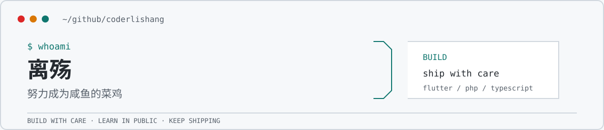

<div align="center">

<picture>
  <source media="(prefers-color-scheme: dark)" srcset="./assets/profile-header-dark.svg">
  <source media="(prefers-color-scheme: light)" srcset="./assets/profile-header-light.svg">
  
</picture>

[](https://github.com/coderlishang?tab=followers)
[](https://gitee.com/codelishang)
[](https://github.com/coderlishang)

</div>

## 关于我

```text
Build with care. Learn in public. Keep shipping.
```

- Mobile applications, backend services, and the details between them.
- Prefer clear code, focused changes, and products that hold up in real use.

## 技术栈

<p>
  
</p>

## 近期活跃

<p>
  <a href="https://github.com/coderlishang">
    
  </a>
  <a href="https://github.com/coderlishang?tab=repositories">
    
  </a>
</p>

<p>
  
</p>

---

<div align="center">
  <sub>Keep building.</sub>
</div>
